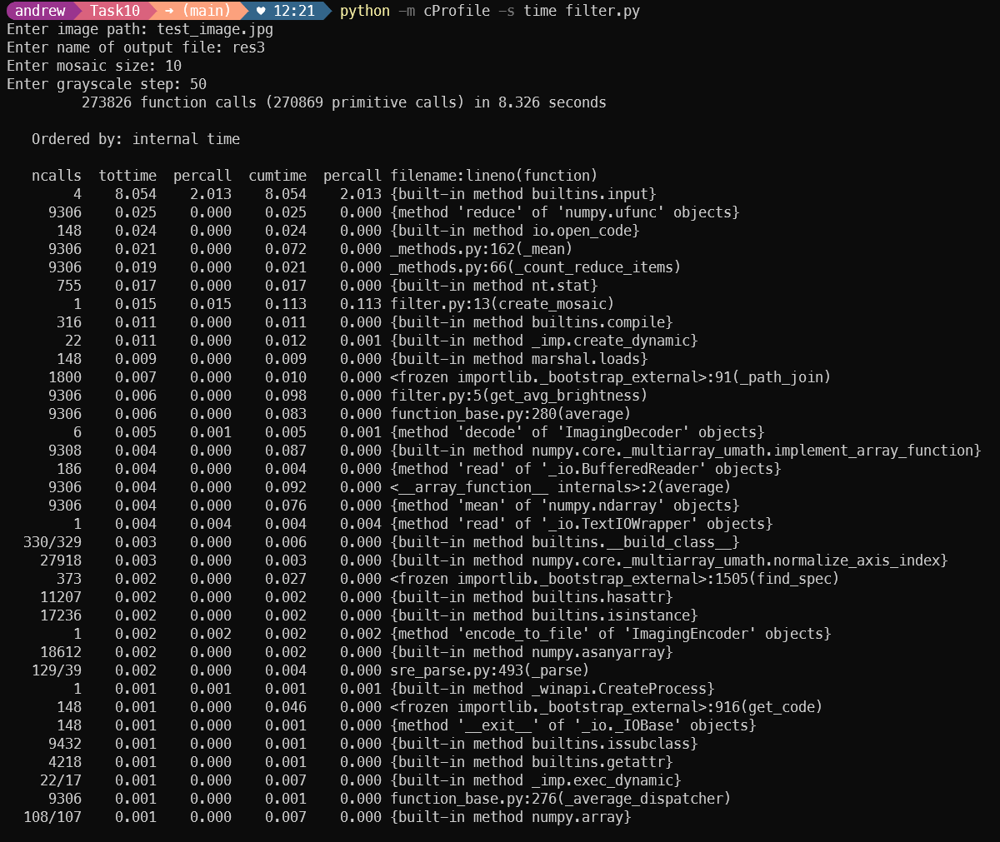
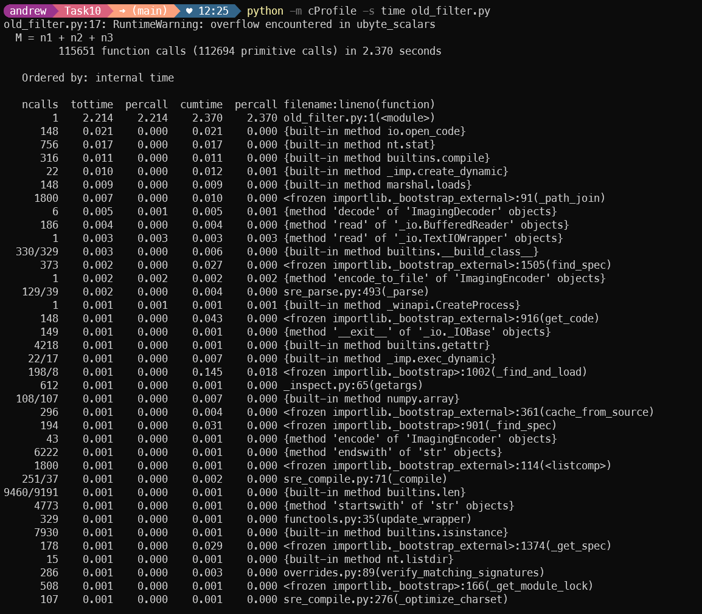
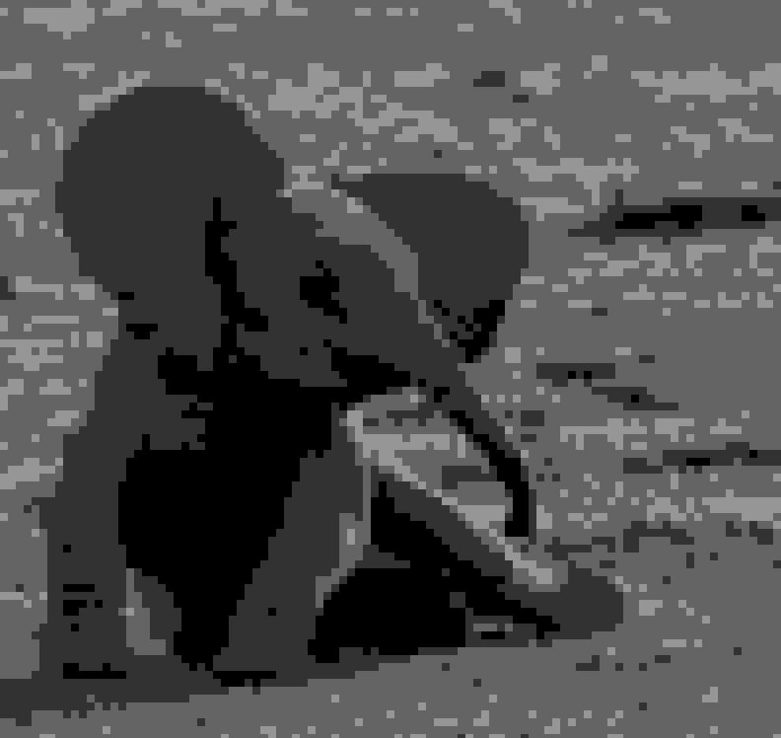

# Task 10
## Профилировние

Результаты профилирования [filter.py](https://github.com/vazik66/Task10/blob/main/filter.py):

Больше всего времени заняла фунция input

Результаты профилирования [old_filter.py](https://github.com/vazik66/Task10/blob/main/old_filter.py):

Результаты профилирования [filter_with_filename.py](https://github.com/vazik66/Task10/blob/main/filter_with_filename.py):

Можно увидеть, что результаты сильно изменились.

## Результаты работы фильтров
Исходное фото

Результат [filter.py](https://github.com/vazik66/Task10/blob/main/filter.py), [filter_with_filename.py](https://github.com/vazik66/Task10/blob/main/filter_with_filename.py)

Результат [old_filter.py](https://github.com/vazik66/Task10/blob/main/old_filter.py) 
